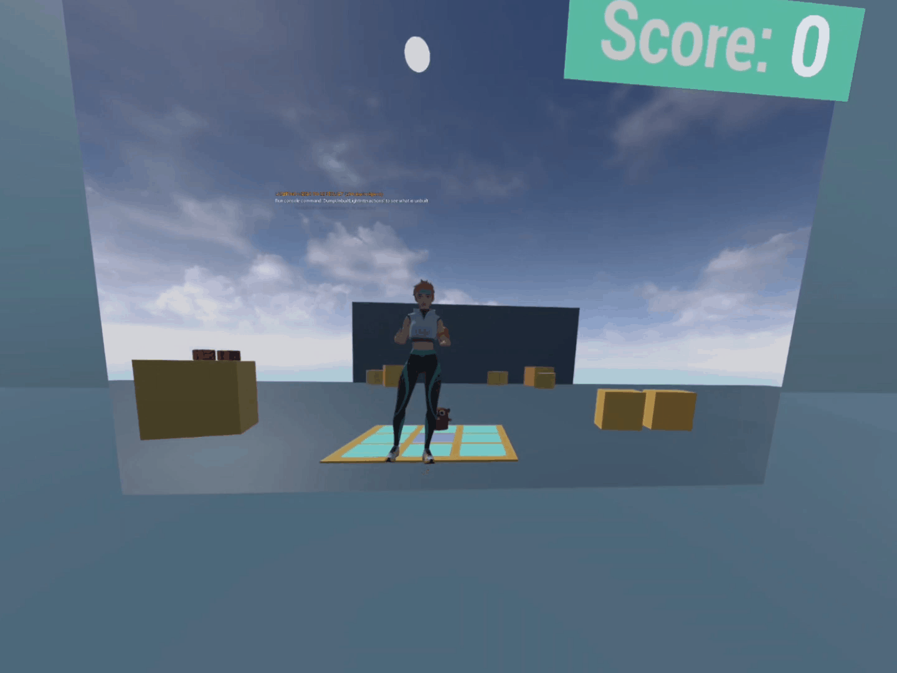
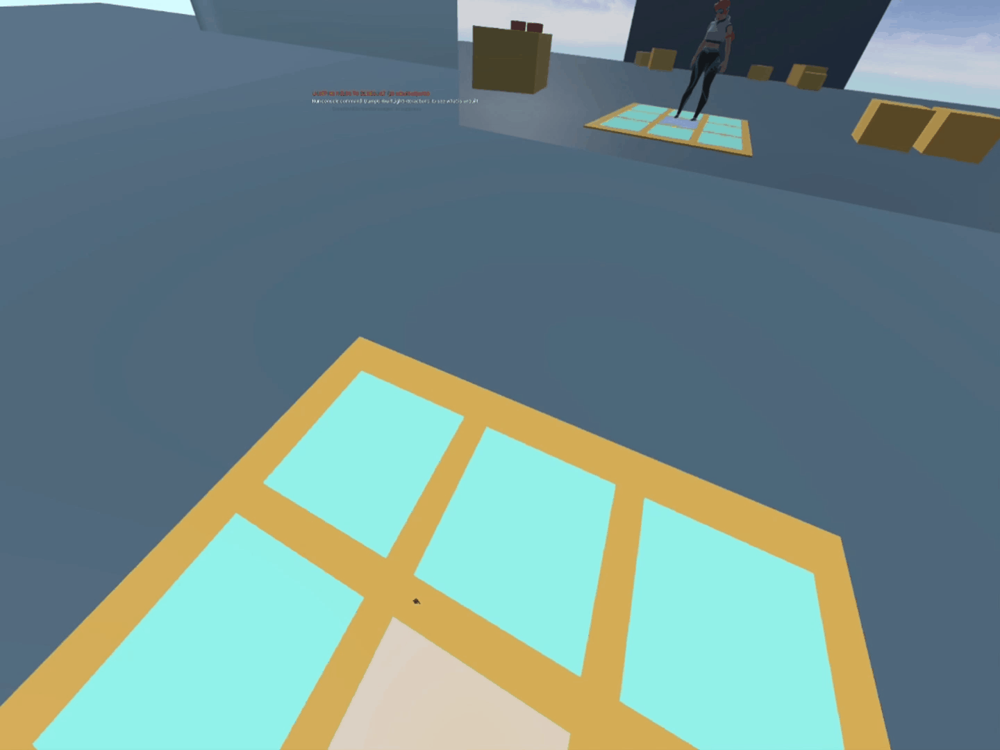
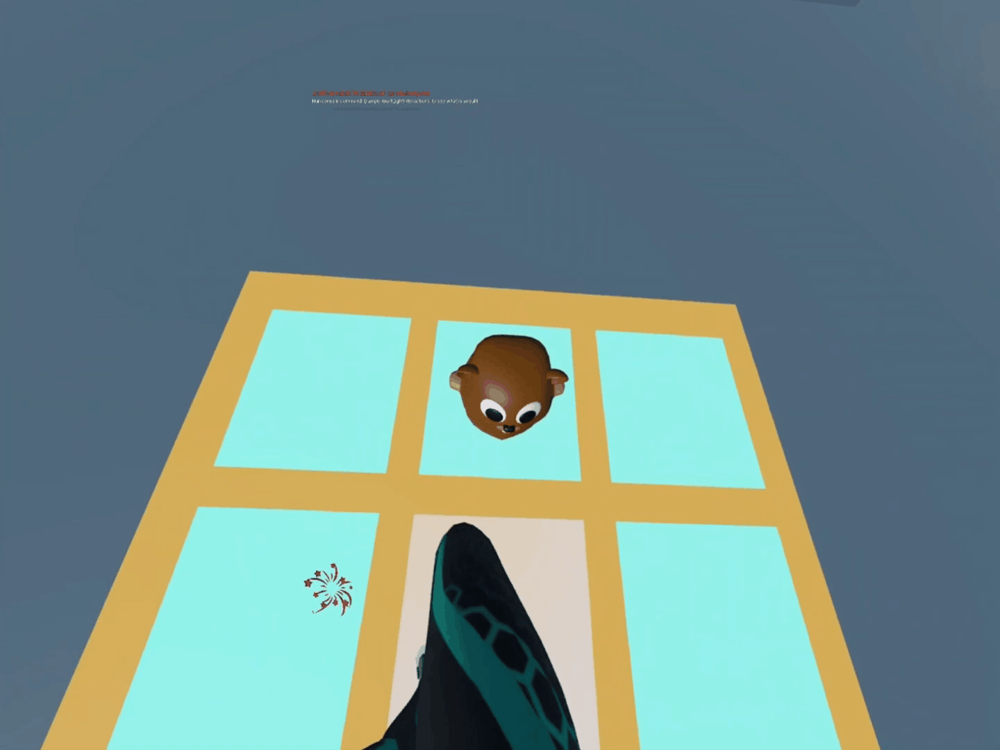
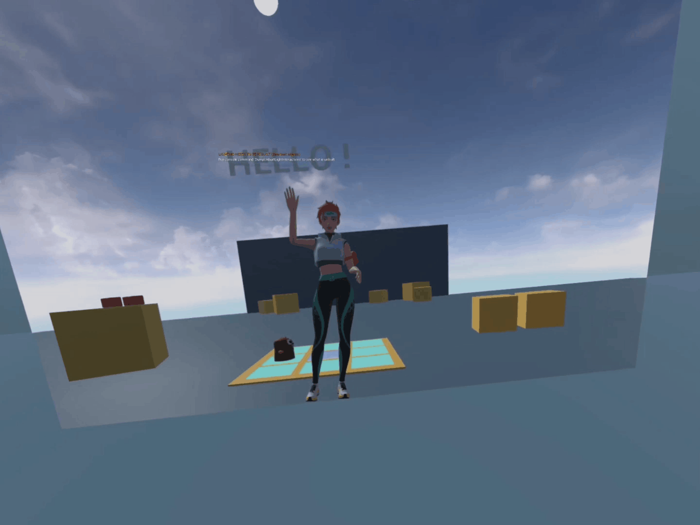
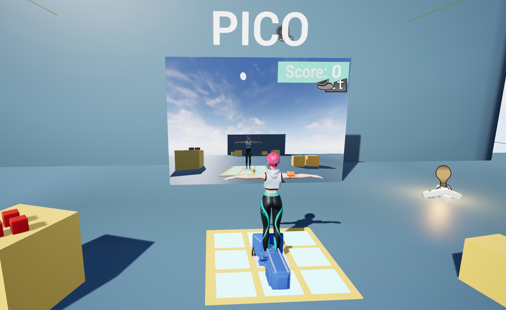
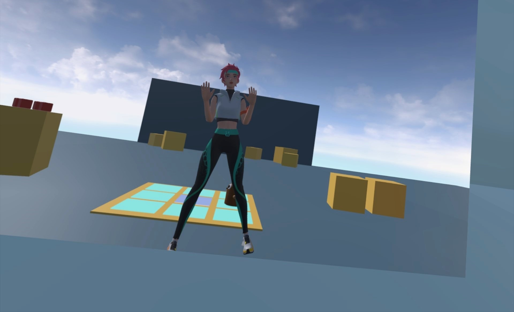

English | [中文README](README.zh_CN.md)  

# PICO Unreal Body Tracking Sample

- If you have any questions/comments, please visit [**PICO Developer Support Portal**](https://picodevsupport.freshdesk.com/support/home) and raise your question there.
 
## Unreal Engine 5 & SDK Version
- Unreal Engine : 5.5.4

- PICO Unreal Integration SDK v3.2.0  

## Description:
The sample implements functions as below:
* Drive Avatar with PICO body tracking data
* Foot stomp particle effect
* Implementation of the Mole Game
* Custom body gesture recognition 
* Move the whole body by using right joystick

|Drive Avatar with PICO body tracking data|Foot stomp particle effect|
|:-:|:-:|
|  |  |

|Implementation of the Mole Game|Custom body gesture recognition|
|:-:|:-:|
|  |  |  

|Sample Scene|Move the whole body by using right joystick|
|:-:|:-:|
|  |  |

## Note:
- This project integrates PICO Unreal Integration SDK 3.2.0 plugin for UE 5.5. If you are using other version Unreal engine, you will need to integrate the corresponding UE version plugin at [here.](https://developer.picoxr.com/resources/#sdk)  
