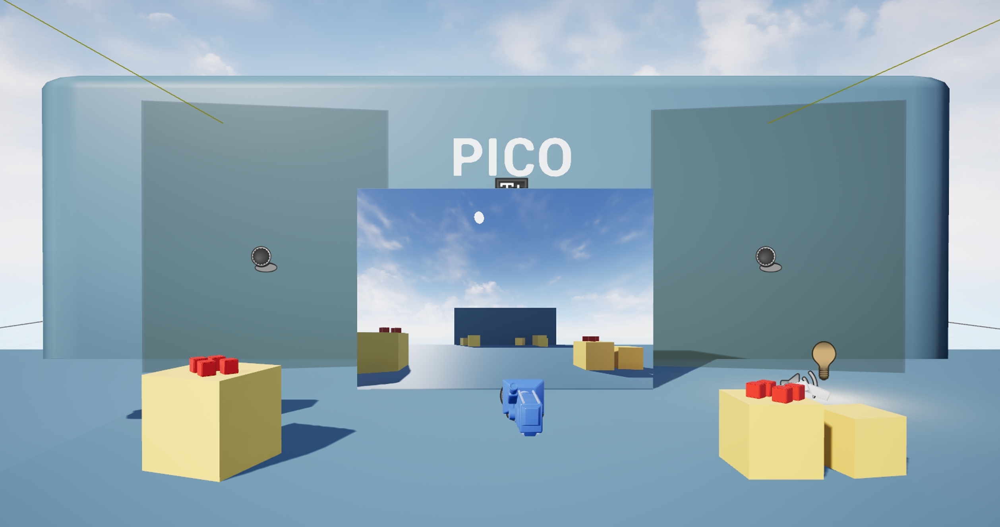
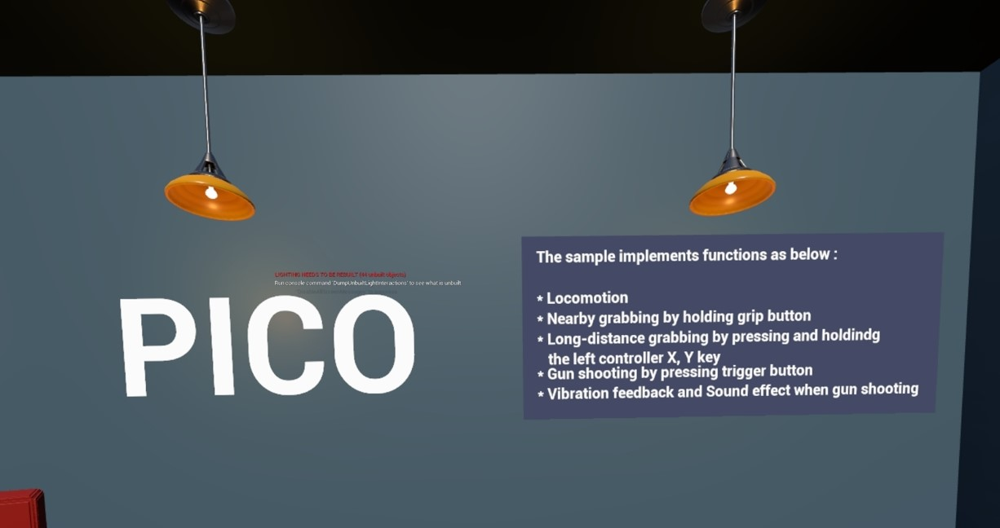
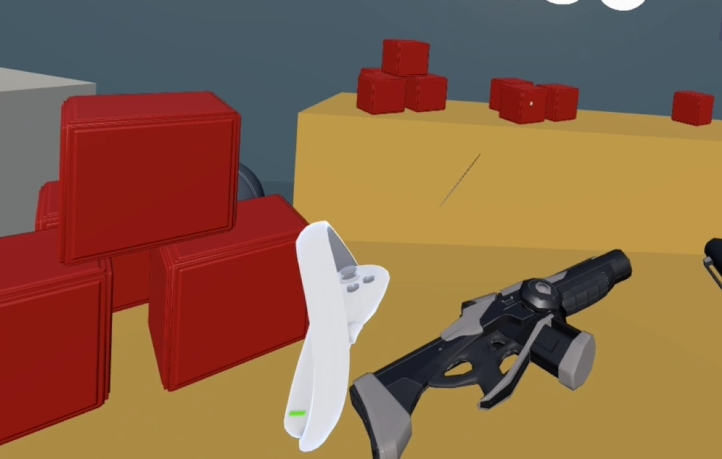

English | [中文README](README.zh_CN.md)

# PICO Unreal Interaction Sample 

- If you have any questions/comments, please visit [**PICO Developer Support Portal**](https://picodevsupport.freshdesk.com/support/home) and raise your question there.

- This sample does not include the PICO Unreal Integration SDK 3.1.0 plugin; please download it from [**PICO Unreal Integration SDK 3.1.0 plugin**](https://developer.picoxr.com/resources/).

## Unreal Engine 5 & SDK Version
- Unreal Engine : 5.3.2

- PICO Unreal Integration SDK v3.1.0

## Description:
  The sample implements functions as below:
* Drive 24 joints nodes with PICO body tracking data
* Move the hold body by using right joystick
* Custom body gesture recognition 

|Sample Scene|Custom body gesture recognition|
|:-:|:-:|
|  |  |
<!--
* Long-distance grabbing by pressing and holdindg the left controller X, Y key
* Gun shoot by pressing trigger button
* Vibration feedback
* Sound effect when grabbing
|Sample Scene|Display the hello text|
|:-:|:-:|
|  |  |
|Gun shoot|Sample Scene|
|:-:|:-:|
|  |  
|ray cast|Long-distance grabbing|
|:-:|:-:|
|  |  |
-->
## Note:
- This project integrates PICO Unreal Integration SDK 3.1.0 plugin for UE 5.3. If you are using other version Unreal engine, you will need to integrate the corresponding UE version plugin at [here.](https://developer.picoxr.com/resources/#sdk)
