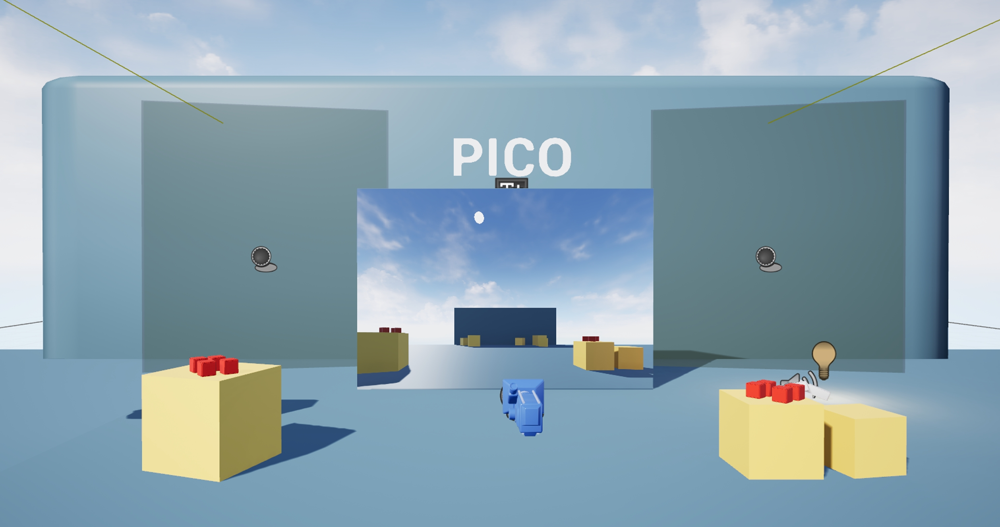
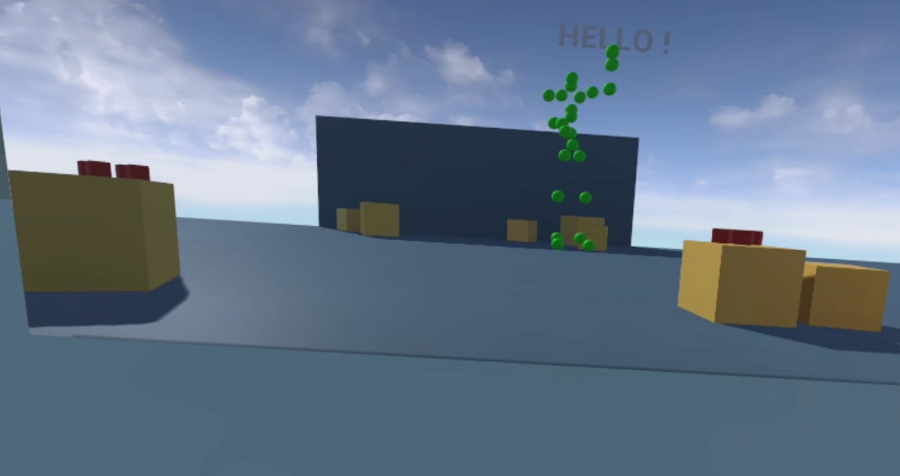
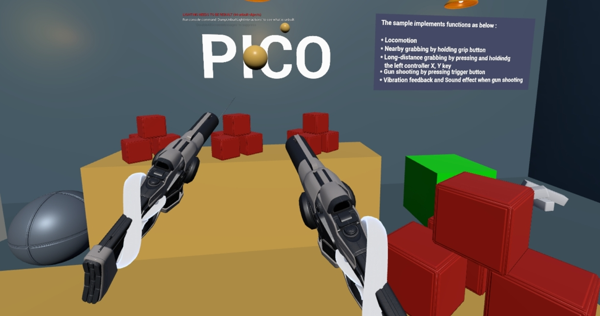
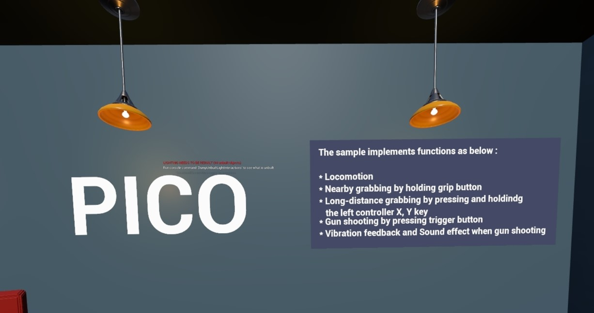
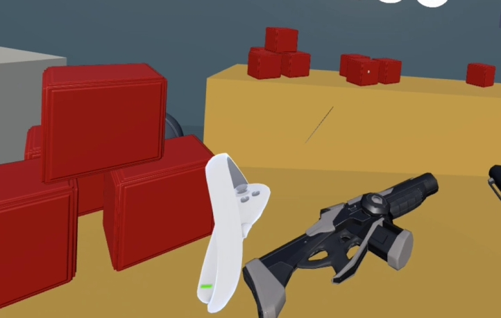
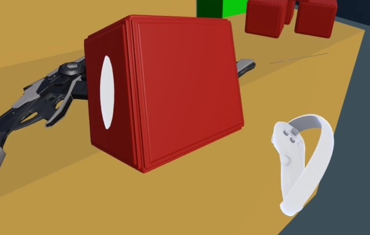

中文 | [英语README](README.md)

# PICO UE5 身体追踪示例

- 如有任何问题/评论，请访问 [**PICO 开发者支持门户网站**](https://picodevsupport.freshdesk.com/zh-CN/support/home) 并在那里提出您的问题。

- 本示例不包含 PICO Unreal Integration SDK 3.1.0 插件；请从以下链接 [**Pico Unreal Integration SDK 3.1.0 插件**](https://developer.picoxr.com/zh/resources/)下载该插件。

## 虚幻引擎 5 & SDK 版本
- 虚幻引擎 : 5.3.2

- Pico Unreal Integration SDK v3.1.0

## Description:
  该示例实现了以下功能：
* 利用 PICO 身体跟踪数据驱动 24 个关节节点
* 使用右操纵杆移动整个身体
* 自定义身体姿势识别 

|示例场景|自定义身体姿势识别|
|:-:|:-:|
|  |  |
<!--
* Long-distance grabbing by pressing and holdindg the left controller X, Y key
* Gun shoot by pressing trigger button
* Vibration feedback
* Sound effect when grabbing
|Sample Scene|Display the hello text|
|:-:|:-:|
|  |  |
|Gun shoot|Sample Scene|
|:-:|:-:|
|  |  
|ray cast|Long-distance grabbing|
|:-:|:-:|
|  |  |
-->
## Note:
<!--- This project integrates Pico Unreal Integration SDK 3.1.0 plugin for UE 5.3. If you are using other version Unreal engine, you will need to integrate the corresponding UE version plugin at [here.](https://developer.picoxr.com/zh/resources/#sdk)-->
- 本项目集成了用于 UE 5.3 的 Pico Unreal Integration SDK 3.1.0 插件。如果您使用的是其他版本的虚幻引擎，则需要在[此处](https://developer.picoxr.com/zh/resources/#sdk)集成相应的 UE 版本插件。